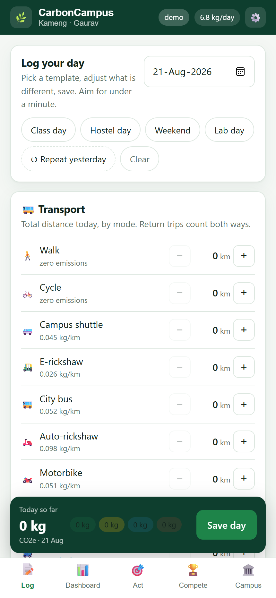
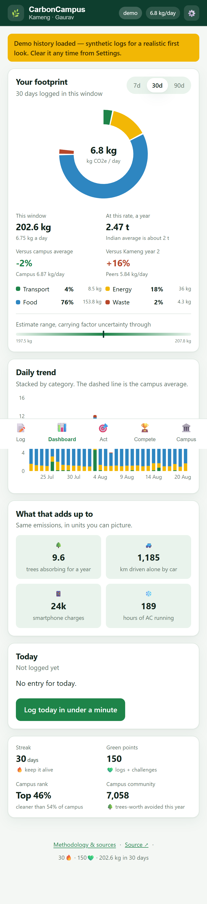
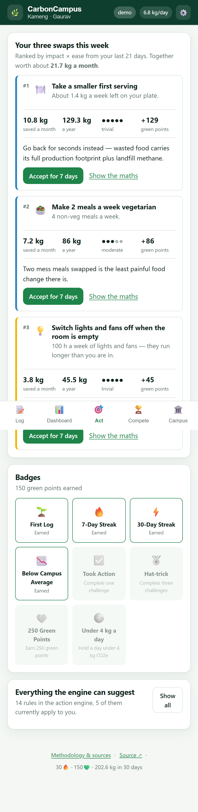
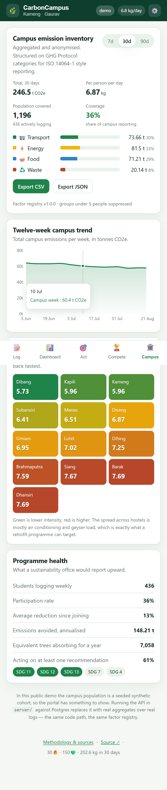

# CarbonCampus

**A campus-calibrated urban carbon footprint calculator.** Log your daily habits in under a
minute, see where your emissions actually come from, and get the three swaps that cut them most —
each one priced in kg CO₂e from your own logs.

**Live demo → https://realgauravvyas.github.io/carboncampus/**

Built for the **Prakriti EcoInnovate Challenge**, Avinya 2026, IIT Guwahati.
Problem statement: *Urban Carbon Footprint Calculator (Software & Web Development)*.
Team **EcoGenesis** — Gaurav Vyas, Mandavi Singh.

---

## What it does

Three loops, the way the proposal scoped them:

| Loop | In the app |
| --- | --- |
| **Measure** | Day templates (class day, hostel day, lab day, weekend), one-tap repeat, steppers for transport, room energy, mess meals and single-use waste. A running total updates as you log. |
| **Understand** | Category breakdown, daily trend, comparison against the campus and against your own hostel-and-year peer cohort, tangible equivalents (trees, km driven, phone charges), and an honest uncertainty band. |
| **Act** | A rule-based action engine ranks every applicable swap by impact × ease and surfaces exactly three, each showing its own arithmetic. Accepting one starts a seven-day challenge worth green points. |

Plus the two halves that make it stick: **hostel and department leagues** ranked by per-person
intensity, and an **admin analytics portal** that exports an aggregated, anonymised campus
inventory as CSV or JSON.

Everything is **auditable**: the Methodology screen lists all 29 emission factors with their
values, uncertainties and links to the published sources they come from.

---

## What it looks like

| The 60-second logger | The dashboard |
| --- | --- |
|  |  |

| The action engine | The admin portal |
| --- | --- |
|  |  |

---

## Try it in thirty seconds

1. Open this [live demo](https://realgauravvyas.github.io/carboncampus/).
2. Enter a name and any email, pick a hostel — nothing is uploaded, it all stays in your browser.
3. At the end of onboarding, choose a **demo persona** to load 30 days of realistic history, and
   the dashboard, recommendations and leagues fill immediately.
4. Install it from your browser menu to use it offline.

Judges in a hurry can skip the quiz — there is a "skip to the demo data" link on the first screen.

---

## Architecture

```
carboncampus/
├── shared/     @carboncampus/shared — factor registry, emission engine,
│               action engine, cohort model. Imported by BOTH sides, so a
│               student's dashboard and the institute's report can never
│               disagree about a number.
├── web/        React 18 + TypeScript + Vite PWA. Recharts for visualisation,
│               IndexedDB for offline logging, hand-written service worker.
├── server/     Fastify + PostgreSQL + Redis API, containerised.
└── .github/    CI: runs the engine test suite, then deploys the PWA to Pages.
```

### Why the demo needs no backend

GitHub Pages serves static files only, so the published demo runs in **local mode**: IndexedDB is
the store of record and the peer population comes from the shared cohort model (seeded, therefore
identical on every device — and clearly labelled as synthetic, never presented as real students).

The same build talks to the real API when it is pointed at one:

```bash
docker compose up --build                       # API + PostgreSQL + Redis
docker compose run --rm api node server/dist/seed.js   # seed a demo campus
VITE_API_BASE=http://localhost:8080 npm run dev # PWA against the live API
```

In API mode, writes still land in IndexedDB first and are queued in an outbox that replays on
reconnect — the offline-first path is the primary path, not a fallback.

### API surface

| Route | Purpose |
| --- | --- |
| `GET /api/health` | Liveness, plus database and cache status |
| `POST /api/profile` | Upsert the user (campus SSO replaces this in production) |
| `POST /api/logs` · `GET /api/logs` | Day logs. **Totals are recomputed server-side** from the raw log, so a tampered payload cannot inflate a leaderboard |
| `GET /api/recommendations` | Top three swaps from the same rule engine the PWA runs |
| `POST /api/challenges` | Accept or complete a challenge |
| `GET /api/leaderboard/hostel` · `/dept` · `/percentile` | Leagues by per-person intensity, Redis-cached for 60 s |
| `GET /api/admin/report?days=30&format=csv` | Campus inventory, aggregated and k-anonymised |
| `GET /api/factors` | The factor registry itself, with every source link |

---

## Development

```bash
npm install          # workspaces: shared, web, server
npm test             # 26 tests over the emission engine
npm run dev          # PWA at http://localhost:5173
npm run dev:api      # API at http://localhost:8080 (needs Postgres, or degrades)
npm run build        # production PWA into web/dist
```

Requires Node 20+. The engine tests run in CI on every push.

---

## How the numbers are produced

**Emissions (kg CO₂e) = Activity Data × Emission Factor** — the IPCC Tier-1 method.

- **Activity data** comes from the daily log: km by mode, appliance-hours, meals, waste items.
- **Emission factors** come from the versioned registry in
  [`shared/src/factors.ts`](shared/src/factors.ts), where each one carries a fractional
  uncertainty and a pointer into the source register in
  [`shared/src/sources.ts`](shared/src/sources.ts).
- **Uncertainty** is propagated in quadrature, so the range shown to users widens more slowly than
  the total — and it is always shown, because these are estimates, not meter readings.
- **Campus calibration** is configuration, not code. A new college is a new factor pack: grid
  region, mess menu, shuttle fleet, hostel list. The engine does not change.

### Validation

- 26 unit tests: hand-computed expectations per category, additivity, uncertainty behaviour,
  registry bounds checks, and an assertion that **every factor resolves to a citable source**.
- Per-capita sanity band: demo personas must land between 1.5 and 20 kg CO₂e/day against an Indian
  average of roughly 2 t CO₂e/person/year.
- Planned for the pilot: reconciling aggregate hostel electricity from logs against the
  institute's metered consumption, and tuning the pack to close the gap.

---

## Data sources

Every emission factor in this app links to one of these. Full detail, including which factor uses
which source, is in [`docs/REFERENCES.md`](docs/REFERENCES.md) and on the app's Methodology screen.

| Source | Used for |
| --- | --- |
| [CEA CO₂ Baseline Database v20, FY 2023-24](https://cea.nic.in/cdm-co2-baseline-database/?lang=en) — Central Electricity Authority, India | Grid electricity factor (0.716 kg CO₂e/kWh), EV and rail traction |
| [MoRTH Road Transport Year Book](https://morth.nic.in/road-transport-year-books) | Vehicle fuel economy and occupancy behind every per-passenger-km factor |
| [Poore & Nemecek (2018), *Science*](https://www.science.org/doi/10.1126/science.aaq0216) | Food life-cycle factors, recombined into Indian mess-plate portions |
| [CPCB solid and plastic waste reports](https://cpcb.nic.in/annual-report-swm/) | Indian end-of-life treatment mix and the organic fraction driving methane |
| [US EPA WARM v16](https://www.epa.gov/warm) | Material-level factors for plastics, paper and e-waste |
| [BEE Standards & Labelling](https://beeindia.gov.in/en/programmesstandards-labeling) | Appliance power ratings |
| [DESNZ/DEFRA 2024 conversion factors](https://www.gov.uk/government/collections/government-conversion-factors-for-company-reporting) | Aviation, where no Indian factor is published |
| [IPCC 2006 Guidelines, 2019 Refinement](https://www.ipcc-nggip.iges.or.jp/public/2019rf/index.html) | The Tier-1 method and GWP-100 basis |
| [GHG Protocol](https://ghgprotocol.org/corporate-standard) · [ISO 14064-1](https://www.iso.org/standard/66453.html) | Structure of the exported campus inventory |
| [US EPA equivalencies calculator](https://www.epa.gov/energy/greenhouse-gases-equivalencies-calculator-calculations-and-references) · [Forest Survey of India](https://fsi.nic.in/forest-report-2023) | The "trees", "km driven" and "phone charges" equivalents |

---

## Privacy

- The public demo has **no account and no server**. Logs live in your browser's IndexedDB.
- **No precise location** is ever requested or stored — the app asks for distance and mode.
- The admin portal sees **group totals only**, and suppresses any group with fewer than five
  people (enforced in the SQL views, not just the UI).
- Your data exports as JSON and erases completely from Settings.

---

## Status and honesty notes

- The synthetic campus cohort exists so leagues and the admin portal have something to show in a
  public demo. It is deterministic, labelled as modelled in both the UI and the API response, and
  replaced by real aggregates the moment the API has rows.
- The email field in onboarding is not authentication. Campus SSO or email OTP is the production
  path; it is not implemented here.
- Factor values are best available public estimates for Indian conditions, not measurements of
  your specific vehicle, room or plate. That is what the uncertainty band is for.

---

## Licence

MIT — see [LICENSE](LICENSE).
